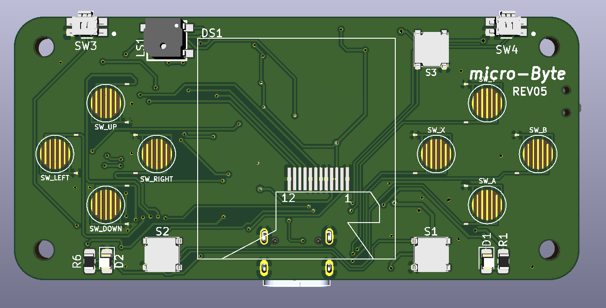

This repository contains the schematics and the PCB design of the microByte project with **KiCad 5.1.6.**

The 3D model of the components were obtained from [SnapEDA](https://www.snapeda.com/).

**If you want to know more about the microByte project go to the next link:**
[Github microByte](https://github.com/jfm92/microByte)

## 3D PCB Images

